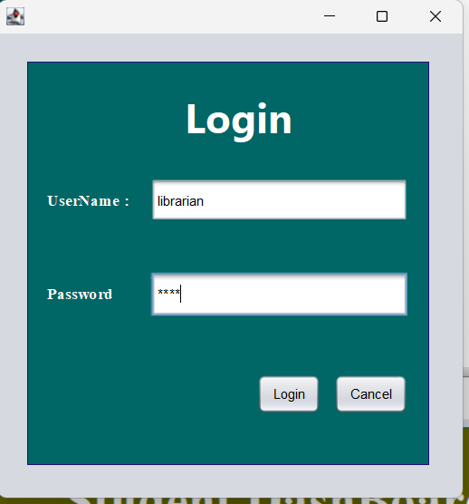
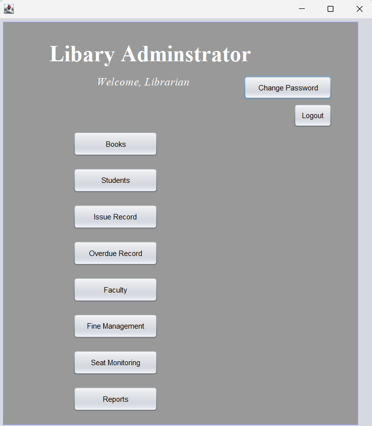
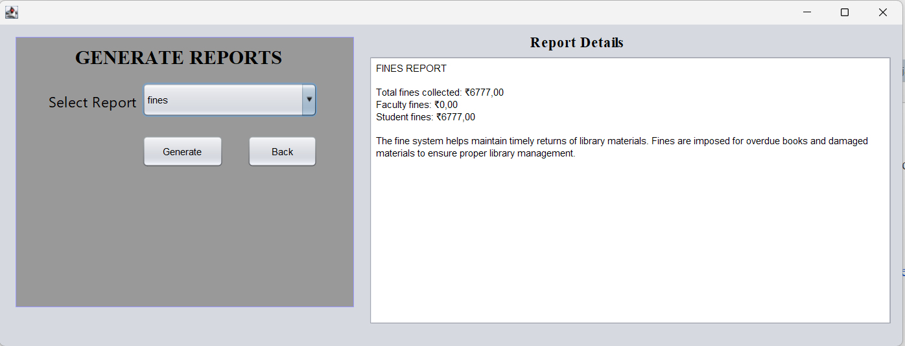

# 📚 Library Management System

A comprehensive **Library Management System** built using **Java Swing** and **MySQL**. This desktop application provides role-based access for **Librarians, Students, and Faculty** to efficiently manage library operations including book issuing, fine calculation, seat reservation, and report generation.

This project demonstrates **database integration, authentication systems, and multi-role dashboards** using Java.

---
## 📌 Project Description

This **Library Management System** was developed as a **2nd Year End Semester Project for Java**.
The project was designed and implemented collaboratively by a team of four students:

* **Takunda Leonard Gorogodo**
* **Budwell K Nyamhamba**
* **Lokesh Karri**
* **Abi Lash**

The goal of the project was to apply core concepts of **Java, Object-Oriented Programming, GUI development using Java Swing, and database integration with MySQL** to build a real-world application.

It showcases practical implementation of:

* Multi-user role-based systems
* Database connectivity using JDBC
* User authentication and authorization
* Modular and structured application design

This project reflects teamwork, problem-solving, and the ability to build a complete functional system from concept to implementation.

---
## 🚀 Features

### 👨‍💼 Librarian

* 📖 Manage books (Add, Update, Delete, Search)
* 👥 Register students and faculty
* 📋 Issue and return books
* 💰 Automatic fine calculation (₹5/day)
* 📊 Generate reports
* 🪑 Monitor seat reservations
* ⏰ Track overdue books

### 🧑‍🎓 Student

* 🔍 Search books
* 🪑 Reserve seats
* 👤 View profile
* 🔐 Change password

### 👨‍🏫 Faculty

* 🔍 Search books
* 👤 View profile
* 🔐 Change password

### 🔐 Authentication

* Role-based login system
* Secure password validation

---

## 🛠️ Technologies Used

* **Java**
* **Java Swing**
* **MySQL**
* **JDBC**
* **NetBeans IDE**

---

## 📂 Project Structure

```id="1b2c3d"
LibraryManagementSystem/
│
├── src/
│   ├── com.lms.librarymanagementsystem.auth/
│   ├── com.lms.librarymanagementsystem.librarian/
│   ├── com.lms.librarymanagementsystem.student/
│   ├── com.lms.librarymanagementsystem.faculty/
│   └── com.lms.librarymanagementsystem.utils/
│
├── lib/
│   ├── mysql-connector-java-8.0.28.jar
│   └── protobuf-java-3.11.4.jar
│
└── README.md
```

---

## ⚙️ Database Schema

### Users Table

```sql id="sql1"
CREATE TABLE users (
    user_id INT PRIMARY KEY AUTO_INCREMENT,
    full_name VARCHAR(100) NOT NULL,
    username VARCHAR(50) UNIQUE NOT NULL,
    password VARCHAR(100) NOT NULL,
    role ENUM('LIBRARIAN', 'STUDENT', 'FACULTY') NOT NULL,
    department VARCHAR(50),
    created_at TIMESTAMP DEFAULT CURRENT_TIMESTAMP
);
```

### Student Table

```sql id="sql2"
CREATE TABLE student (
    student_id INT PRIMARY KEY AUTO_INCREMENT,
    user_id INT UNIQUE,
    phone VARCHAR(15),
    fines DECIMAL(10,2) DEFAULT 0.00,
    issued_books INT DEFAULT 0,
    reserved_seat BOOLEAN DEFAULT FALSE,
    FOREIGN KEY (user_id) REFERENCES users(user_id) ON DELETE CASCADE
);
```

### Faculty Table

```sql id="sql3"
CREATE TABLE faculty (
    faculty_id INT PRIMARY KEY AUTO_INCREMENT,
    user_id INT UNIQUE,
    phone VARCHAR(15),
    fines DECIMAL(10,2) DEFAULT 0.00,
    issued_books INT DEFAULT 0,
    FOREIGN KEY (user_id) REFERENCES users(user_id) ON DELETE CASCADE
);
```

### Books Table

```sql id="sql4"
CREATE TABLE books (
    book_id INT PRIMARY KEY AUTO_INCREMENT,
    title VARCHAR(200) NOT NULL,
    author VARCHAR(100),
    publisher VARCHAR(100),
    isbn VARCHAR(20) UNIQUE,
    department VARCHAR(50),
    subject VARCHAR(50),
    status ENUM('AVAILABLE', 'ISSUED', 'LOST') DEFAULT 'AVAILABLE'
);
```

### Book Issue Table

```sql id="sql5"
CREATE TABLE book_issue (
    issue_id INT PRIMARY KEY AUTO_INCREMENT,
    book_id INT,
    user_id INT,
    issue_date DATE,
    due_date DATE,
    return_date DATE NULL,
    FOREIGN KEY (book_id) REFERENCES books(book_id),
    FOREIGN KEY (user_id) REFERENCES users(user_id)
);
```

### Seat Reservation Table

```sql id="sql6"
CREATE TABLE seat_reservation (
    seat_no INT PRIMARY KEY,
    student_id INT NULL,
    status ENUM('FREE', 'OCCUPIED') DEFAULT 'FREE',
    time_in TIMESTAMP NULL,
    time_out TIMESTAMP NULL,
    FOREIGN KEY (student_id) REFERENCES student(student_id) ON DELETE SET NULL
);
```

---

## 🖼️ Screenshots

> 📌 Place all images inside a folder named **screenshots/** in your project.

### 🔐 Login Page



### 👨‍💼 Librarian Dashboard



### 🧑‍🎓 Student Dashboard


### 👨‍🏫 Faculty Dashboard


### 📖 Books Management


### 📋 Book Issue


### 🪑 Seat Reservation


### 📊 Reports



### 👤 Student Profile


### 👤 Faculty Profile


---

## ▶️ How to Run

### Prerequisites

* Java JDK 8+
* MySQL Server
* NetBeans / IntelliJ

---

### Steps

```bash id="run1"
git clone https://github.com/takundagorogodo/LibraryManagementSystem.git
cd LibraryManagementSystem
```

1. Create database `library_db`
2. Run all SQL tables above
3. Configure DB in `DataBaseConnection.java`
4. Add MySQL connector JAR
5. Run `LOGIN.java`

---

## 🔑 Default Credentials

* **Librarian**
  Username: admin
  Password: admin123

* **Student**
  Username: student
  Password: student123

* **Faculty**
  Username: faculty
  Password: faculty123

---

## 🎯 What I Learned

* Java Swing GUI Development
* JDBC & MySQL Integration
* Role-Based Access Control
* Database Design
* Exception Handling
* Real-world Application Structure

---

## 📌 Future Improvements

* 📧 Email notifications
* 📊 Analytics dashboard
* 📱 Web/mobile version
* 🔐 Two-factor authentication
* 📷 Barcode integration

---

## 👨‍💻 Author

**Takunda Leonard Gorogodo**

CSE Student | Software Developer

---

## 📄 License

This project is for **educational purposes**.

---

## 🙏 Acknowledgments

* Oracle (Java & MySQL)
* NetBeans Community
* Open-source contributors
